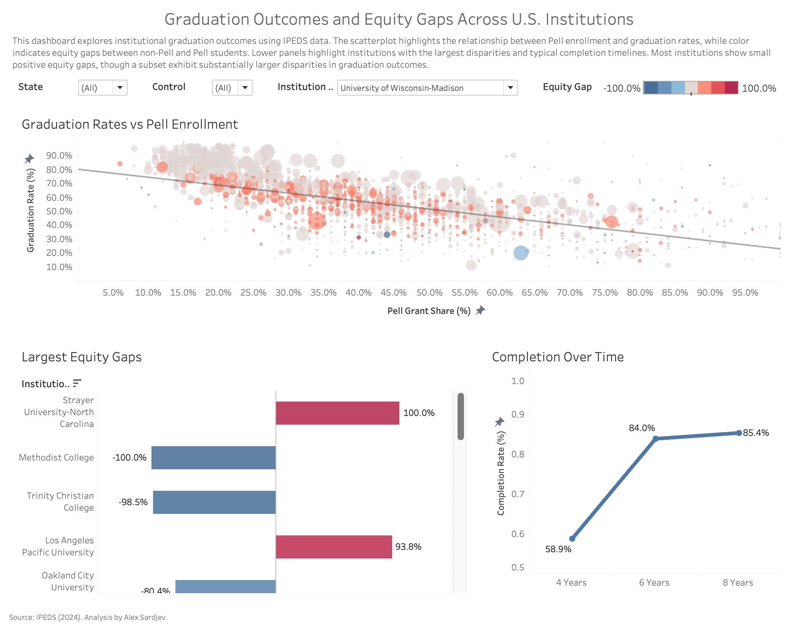

# Graduation Outcomes and Equity Gaps Across U.S. Institutions
A data analysis project examining graduation outcomes and equity gaps across U.S. higher education institutions using IPEDS data.

## Overview
This project analyzes institutional graduation outcomes using IPEDS data, with a focus on equity gaps between Pell and non-Pell students. The goal is to explore how graduation rates vary across institutions and identify disparities in student outcomes. This analysis highlights how aggregate institutional success can mask meaningful disparities in student outcomes.

## Key Findings
- Most institutions exhibit small positive equity gaps, with non-Pell students graduating at slightly higher rates
- A subset of institutions show substantially larger disparities in graduation outcomes
- Higher Pell enrollment is associated with lower overall graduation rates
- Completion rates increase significantly between 4 and 6 years, with smaller gains thereafter
- These patterns suggest that overall institutional performance does not necessarily reflect equitable outcomes across student groups.

## Data Sources
- IPEDS Graduation Rates (GR2024)
- IPEDS Outcome Measures (OM2024)
- IPEDS Financial Aid Data
- IPEDS Institutional Characteristics (HD2024)

## Tools Used
- PostgreSQL (data cleaning and joins)
- Tableau (visualization and dashboard design)

## Methodology
- Joined multiple IPEDS datasets using UNITID  
- Constructed equity gap metric (non-Pell minus Pell graduation rate)  
- Filtered institutions using minimum completion thresholds to reduce noise from small cohorts  
- Structured data for use in Tableau dashboards

## Project Files
- `graduation_dashboard.twb` – Tableau dashboard file containing all visualizations
- `dashboard-screenshot.jpeg` – Snapshot of the final dashboard
- `sql/create_master_dataset.sql` – SQL script used to clean and join IPEDS datasets into a master analysis dataset

## Author
Alex Sardjev
